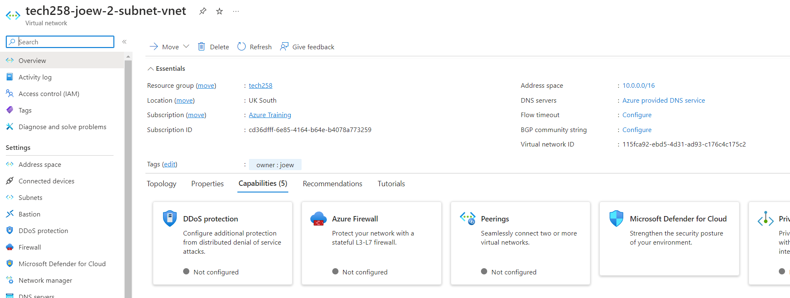
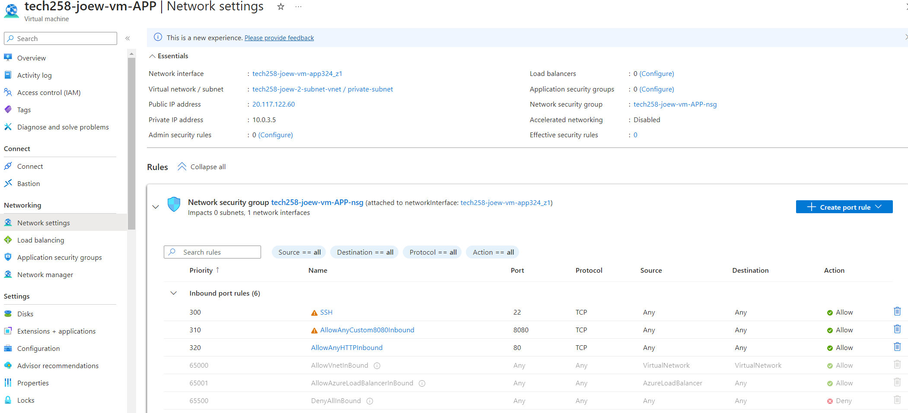
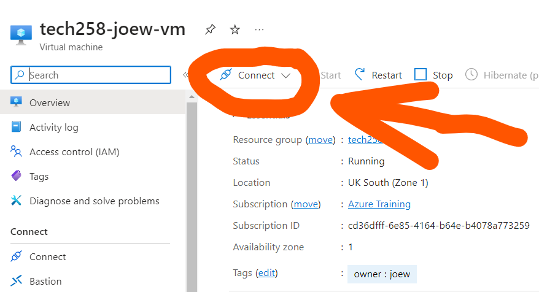

# What is 2 Tier Arcitecture Deployment?

Two-tier architecture deployment divides an application into two layers: the frontend tier, which interacts with users and presents the user interface through web servers or client-side applications, and the backend tier, responsible for business logic, data processing, and storage using databases, application servers, or APIs. This setup simplifies management but may have scalability limitations compared to more complex architectures.

# 2 Tier App Deployment in Azure

In this guide, we will deploy a 2-tier application on Azure, consisting of a frontend web server and a backend database server. We will set up our own Virtual Network (VNet) and configure Virtual Machines (VMs) to run the application.

## Setup VNet

This allows the app and the database to communicate.

1. Navigate to the Azure Portal.
2. Create a new Virtual Network:
   - Name: `tech258-yourname-2-subnet-vnet`
   - Address space: `10.0.0.0/16`
3. Add subnets:
   - **public-subnet**: 
     - Subnet name: `public-subnet`
     - Address range: `10.0.2.0/24`
   - **private-subnet**: 
     - Subnet name: `private-subnet`
     - Address range: `10.0.3.0/24`



## Setup VMs

1. Create VM for backend (MongoDB):
   - Image: Ubuntu Pro 22.04 LTS - x64 Gen2
   - Security: Standard
   - Size: Standard_B1s
   - NSG: SSH (Don't need to add 27017 after VM is launched, as explained later.)
   - Default username: Change to `adminuser`
   - Keypair: Use the SSH key we have created and linked to Azure
   - Disk: Change from premium SSD to standard SSD
   - Network: Use the previously created VNet, place app VM in public subnet and database VM in private subnet
   - Tags: Add an owner tag for identification

We don't have to allow access to port 27017 for MongoDB, as Azure automatically creates system routes and assigns the routes to each subnet in a virtual network.

2. Create VM for frontend (App):
   - Image: Ubuntu Pro 22.04 LTS - x64 Gen2
   - Security: Standard
   - Size: Standard_B1s
   - NSG: SSH (will need to add HTTP traffic after VM is launched)
   - Default username: Change to `adminuser`
   - Keypair: Use the SSH key we have created and linked to Azure
   - Disk: Change from premium SSD to standard SSD
   - Network: Use the previously created VNet, place app VM in public subnet and database VM in private subnet
   - Tags: Add an owner tag for identification

When creating the VM, allow SSH connection, and once fully created, enter the network security group settings, and allow access for HTTP traffic. We don't have to allow access to port 3000 either, as Azure automatically creates system routes and assigns the routes to each subnet in a virtual network. The image below shows the correct tab.



## Deploy App and Database



Use the SSH command below to access the VMs. Then run each script for each VM. Or follow the steps below.

```
ssh -i ~/.ssh/tech258_joew_az_key adminuser@172.187.91.87
```

Use the scripts previously created for AWS Deployment. Or just follow the steps below.
   
1. Configure the backend VM (in private subnet):
   - Install and configure the database software (e.g., MongoDB).
   - Ensure the database is running and accessible only from the frontend VM.

2. Configure the frontend VM (in public subnet):
   - Change the DB_HOST env to the private IP of the database VM instance.
   - Install and configure NGINX and NodeJS.
   - Ensure the app is running and accessible.
   - The app should be accessible through the public IP address of the app VM instance, and the database screen is accessible through the public IP + /posts.

Congratulations! You have successfully deployed a 2-tier app on Azure.


