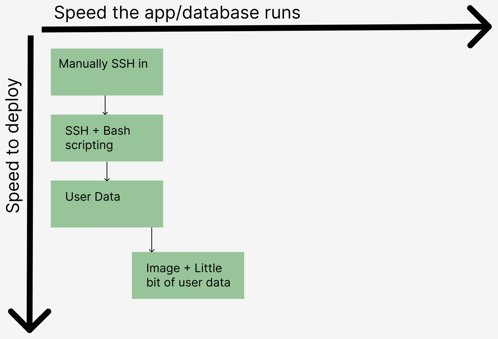

# App Deployment - Levels of Automation

 

# 2 Tier App Deployment using User Data on Azure

## What is User Data?
User data refers to the ability to run a script on a VM as soon as its been created. It is found as a empty text box in the advanced tab when creating a VM. This rapidly increases the deployment time of an app, as we no longer have to SSH into the VM through our bash terminal and run the script through a nano command. This also reduces the amount of human input needed to essentially none.

## How does using User Data speed up deployment time but not the speed the app/database runs?
This is because the app/database still has to run the same amount of commands to deploy. The time save to deploy comes from the removal of the human input when SSHing in and running the script manually.

## How to utilize User Data
It can be found in the advanced tab when creating a VM. Paste your script into the text box, ensuring that you have `#!/bin/bash` at the start of your script. This tells the operating system to use Bash to interpret and execute the commands within the script. Another thing to note is that the commands within that script are executed with elevated privileges, typically as the root user or using sudo. This behavior is by design and is intended to ensure that the commands specified in the user data script can perform actions that require administrative permissions, such as installing software packages, configuring system settings, and setting up the environment.

 

# 2 Tier App Deployment using Images on Azure

## What are images or AMIs (Amazon Machine Image)?
An AMI is an exact replica of the disc. All things installed and configured remain the same (NGINX, NodeJS, etc). An image can also be thought of as a pre-configured environment, and can be set up while creating a VM. Images typically contain pre-configured environments with all necessary dependencies, libraries, and configurations already set up. This eliminates the need to manually install and configure software components during deployment, saving time and reducing the risk of configuration errors. This also means that the environment is consistant, reducing human error.

## How does using an image speed up deployment time as well as the speed the app/database runs?
This is because the image we use comes preinstalled and preconfigured with software such as NGINX. This means the script needs to contain less commands to deploy the app. The time save does not come from quicker commands, as they will always remain the same speed, but comes from reducing the amount of commands.