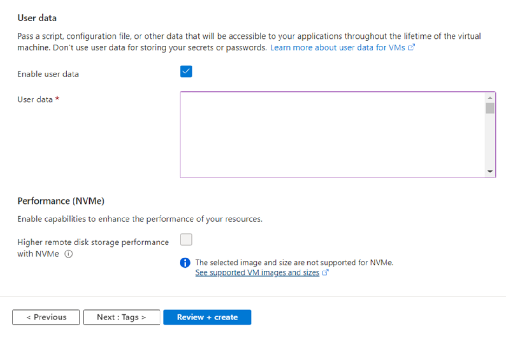
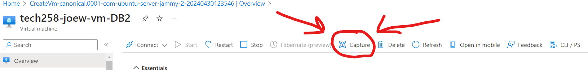

# App Deployment - Levels of Automation

 

# 2 Tier App Deployment using User Data on Azure

## What is User Data?
User data refers to the ability to run a script on a VM as soon as its been created. It is found as a empty text box in the advanced tab when creating a VM. This rapidly increases the deployment time of an app, as we no longer have to SSH into the VM through our bash terminal and run the script through a nano command. This also reduces the amount of human input needed to essentially none.

## How does using User Data speed up deployment time but not the speed the app/database runs?
This is because the app/database still has to run the same amount of commands to deploy. The time save to deploy comes from the removal of the human input when SSHing in and running the script manually.

## How to utilize User Data
It can be found in the advanced tab when creating a VM. Paste your script into the text box, ensuring that you have `#!/bin/bash` at the start of your script. This tells the operating system to use Bash to interpret and execute the commands within the script. Another thing to note is that the commands within that script are executed with elevated privileges, typically as the root user or using sudo. This behavior is by design and is intended to ensure that the commands specified in the user data script can perform actions that require administrative permissions, such as installing software packages, configuring system settings, and setting up the environment.

 

# 2 Tier App Deployment using Images on Azure

## What are images? 
An Azure Image, or AMIs (Amazon Machine Image) for AWS, is an exact replica of the disc. All things installed and configured remain the same (NGINX, NodeJS, etc). An image can also be thought of as a pre-configured environment, and can be set up while creating a VM. Images typically contain pre-configured environments with all necessary dependencies, libraries, and configurations already set up. This eliminates the need to manually install and configure software components during deployment, saving time and reducing the risk of configuration errors. This also means that the environment is consistant, reducing human error.

## How does using an image speed up deployment time as well as the speed the app/database runs?
This is because the image we use comes preinstalled and preconfigured with software such as NGINX. This means the script needs to contain less commands to deploy the app. The time save does not come from quicker commands, as they will always remain the same speed, but comes from reducing the amount of commands.

## What is and isn't included in an Image

### Included:

* **Operating System:** The image typically features a specific OS version, like Windows or Linux, alongside relevant updates and patches.
* **Software Configurations:** It includes installed software, packages, and configurations present on the original VM.
* **Customizations:** Any tailored settings, scripts, or applications installed or configured on the VM.

### Excluded:

* **User Data:** Image creation excludes user-specific data or settings, such as user accounts, files, and individual runtime data.
* **Temporary Data:** It omits temporary files or caches that aren't part of the core system configuration.
* **Sensitive Information:** Confidential data like passwords, encryption keys, or API tokens should be kept out of the image.

### Side-Effect of Image Creation:
While creating an image in Azure, the original VM remains unaffected and operational. However, the disk is reallocated, so while the image is being captured, the VM is paused (re-alloacted), so that system operations are not disturbed.

 

# How to Create an Image

1. Navigate to the Azure portal.
2. In the Azure portal, locate the VM instance.
3. Select the app VM instance and access its management interface.
4. Within the management interface, locate the option to create an image or snapshot of the VM.

5. Name the new image similar to `tech258-joew-ubuntu2204-app/DB-ready-to-run`.
6. Follow the prompts to create the image, ensuring to select appropriate options for snapshotting.
7. Once the image creation process is complete, the new pre-provisioned app image is ready for use.

# How to create the App/Database VM Using a Pre-Provisioned Image

1. In the VM creation wizard, select the option to use an existing image.
2. Choose the pre-provisioned app image named `tech258-joew-ubuntu2204-ready-to-run`.
3. Proceed with configuring the VM settings as needed. Ensure the license type is set to other.

4. When prompted for user data, paste in the user data script for starting the app/DB.
5. For the app VM, ensure that the user data script includes setting the DB_HOST environment variable, navigating into the app folder, installing dependencies with npm install, and starting the app with pm2.
6. Complete the VM creation process and wait for the new app VM to be provisioned.
7.  Once provisioned, the app VM will be ready for use, with the app running as per the provided user data script.

## Side Note - Changing permissions

1. Use sudo -E 
2. (Recursively) Change permissions using chmod (777)
3. (Recursively) Take ownership of the folder. 
4. Temporarily login as root