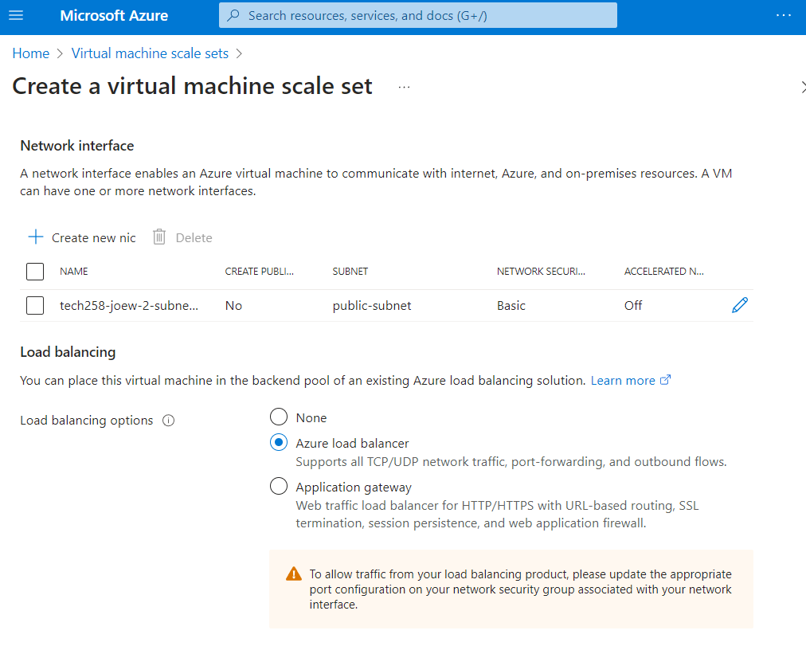

# Autoscaling

Autoscaling automatically responds by starting or turning off VMs when they reach a threshold specified by you, and allows us to scale out, and scale in. This doesn't mean scaling up or scaling down, as this refers to your current VM being replaced by a smaller/larger VM.

Autoscaling increases/decreases the amount of VMs running as well as the current one.

The diagram belows explains the structure of a VM scale set.

# Creating and Testing Azure Virtual Machine Scale Set

## Preparing for Scale Set Creation

Choose a base image for your VM instances. This could be a custom image or one provided by Azure. We used a custom image, one that we had created earlier to run our app, with NGINX and NodeJS already configured and enabled.

## Creating a Virtual Machine Scale Set

Follow these steps to create a Virtual Machine Scale Set:

1. **Create a Scale Set**: In the Azure portal, navigate to "Create a resource" > "Compute" > "Virtual machine scale set".

2. **Configure Basics**: Enter basic information like name, subscription, resource group, and region.

3. **Configure VM Size**: Choose the VM size based on your requirements and budget.

4. **Configure Scaling Options**: Set scaling options such as instance count, scaling rules, and load balancer integration.

5. **Configure Networking**: Select the virtual network and subnet for your VM instances.

6. **Configure Management**: Set up monitoring, diagnostics, and other management options as needed.

7. **Review and Create**: Review the configuration settings and create the Scale Set.

## Load Balancer and Its Importance

A load balancer distributes incoming network traffic across multiple VM instances to ensure no single instance is overwhelmed, improving reliability and availability. This is done through the settings on the autoscale, as we can alter the CPU load limits, the max and min VMs, and the initial VMs. It also helps in scaling out applications by distributing traffic evenly.

## Managing Instances

### Reimaging vs. Upgrading

- **Reimaging**: Reimaging a VM instance replaces its OS disk with a clean image, resetting the instance to its initial state. This allows us to change the user data, and run it.
- **Upgrading**: Upgrading a VM instance involves updating its OS and software packages to newer versions while retaining data and configurations.

## Testing Instance Health

### Creating an Unhealthy Instance

To simulate an unhealthy instance for testing purposes:

1. Identify Instance: Choose an instance in your Scale Set.
2. Introduce failure by reimaging an instance, and remove the user data, so the instance stops working
3. After the period stated by you when creating the scale set, the instance will show to be unhealthy. the default is 10 minutes.

## SSH Access to Instance in Scale Set

To SSH into an instance in your Scale Set, open the SSH client and connect using the instance's public IP and SSH key, as well as specifying which port you want to enter through. For this purpose, it would be 50001, as earlier we set the port range to be from 50000.

## How to clean up a scale set 

1. Delete the scale set itself
2. Delete the load balancer
3. Delete the public IP address of the load balancer

