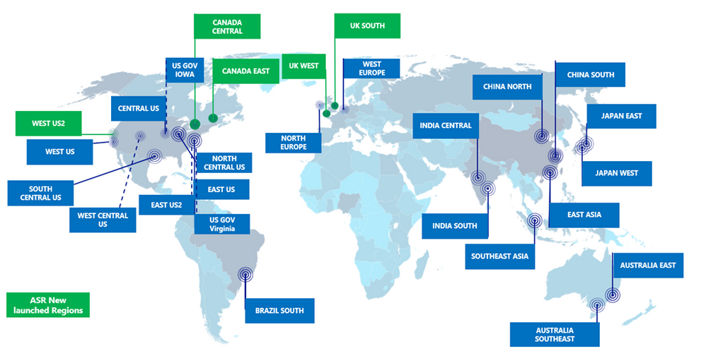
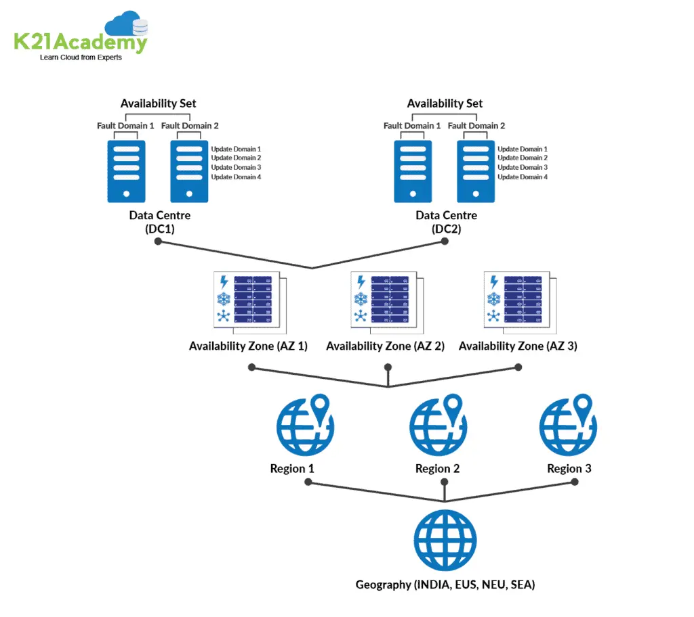
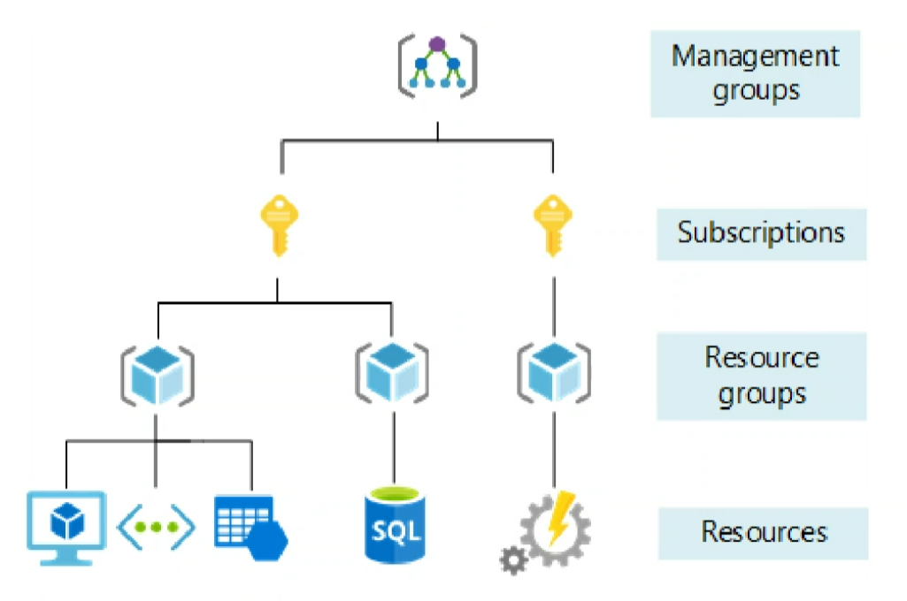

# Tech 258

# Microsoft Azure

# The Basics of Azure 
Azure is Microsoft's cloud computing platform that offers a diverse range of services, including computing, storage, networking, databases, analytics, and artificial intelligence. It enables businesses to build, deploy, and manage applications and services globally through Microsoft's extensive network of data centers.

## Azure regions and availability zones: 
* Azure regions are geographic locations where Microsoft operates data centers, each comprising one or more data centers. 

* Availability zones are physically separate data centers within a region, providing redundancy and fault tolerance. Deploying resources across availability zones ensures high availability and resiliency.

## How Azure is structured/organised 
Azure organizes its services into categories such as Compute, Storage, Networking, Databases, AI and Machine Learning, and Developer Tools. These services are further grouped into resource groups, subscriptions, and management groups to facilitate effective resource management.

## Types of services offered by Azure
**Azure provides a broad array of services:** 
* Computing (virtual machines, containers) 
* Storage (blobs, files, tables) 
* Networking (virtual networks, load balancers) 
* Databases (SQL Database, Cosmos DB) 
* AI and Machine Learning (Cognitive Services, Machine Learning) 
* Developer tools (Azure DevOps, Visual Studio)

## Accessing Azure
Users can access Azure through various means, including the Azure Portal (web-based interface), Azure CLI (command-line interface), Azure PowerShell (PowerShell cmdlets), Azure APIs (REST APIs), and the Azure Mobile App (mobile application).

## Difference between Azure and Azure DevOps
Azure is a cloud computing platform that provides infrastructure and services for building, deploying, and managing applications and services. Azure DevOps, on the other hand, is a suite of development tools and services for collaboration, software development, and DevOps practices. It includes services like Azure Repos, Azure Pipelines, Azure Boards, Azure Test Plans, and Azure Artifacts.

## Benefits of using the Azure Pricing Calculator
The Azure Pricing Calculator helps estimate the cost of using Azure services based on specific requirements. By selecting desired services and configuring resources, users can obtain a monthly cost estimate. This assists in budgeting, planning, and optimizing costs by selecting suitable services and configurations.

# Azure Resource Management Structure

Azure offers a robust resource management system that helps organize and control various aspects of your cloud infrastructure. Understanding the hierarchy and key concepts is crucial for efficient utilization of Azure resources.

## Resource Groups

Resource groups serve as logical containers for grouping Azure resources such as virtual machines, databases, and web apps. They provide a unified management interface and facilitate streamlined operations. Notably, resource groups cannot be nested within each other, similarly to containers within containers.

## Subscriptions

Subscriptions in Azure define the way users pay for services and resources they consume. There are different types of subscriptions tailored to various needs, including:

- **Student Subscription**: Designed for educational purposes, often with limited features.
- **Trial Subscription**: Offers a limited-time trial period with access to Azure services.
- **Pay-As-You-Go Subscription**: Popular among small businesses, offering flexibility and pay-per-usage billing.
- **Corporate Account**: Tailored for large-scale enterprises with potential discounts based on usage volume.

Each subscription has its own limits and quotas to manage resource consumption effectively.

## Management Groups

Management groups provide a hierarchical structure for organizing subscriptions and applying policies across multiple Azure subscriptions. They can be compared to folders and can be nested up to six layers deep. Management groups enable centralized governance and access control.

## Scopes and Access Control

At each level of the Azure hierarchy (resource groups, subscriptions, and management groups), access control and policies can be applied. This enables granular control over permissions and governance, ensuring compliance and security across the Azure environment.

Understanding the structure and capabilities of Azure resource management is essential for effectively leveraging Azure services while maintaining control and governance.

