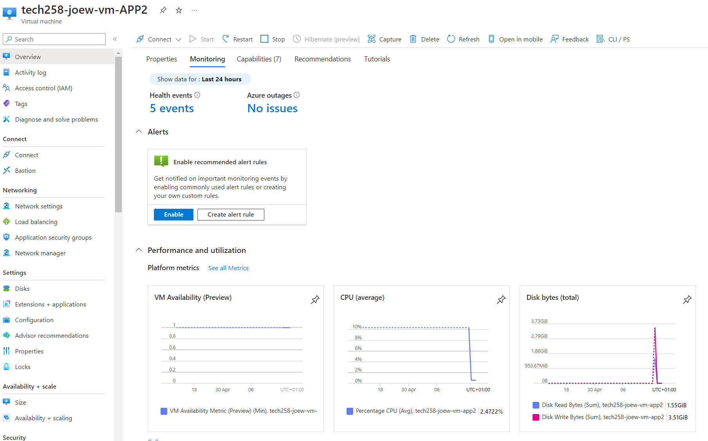
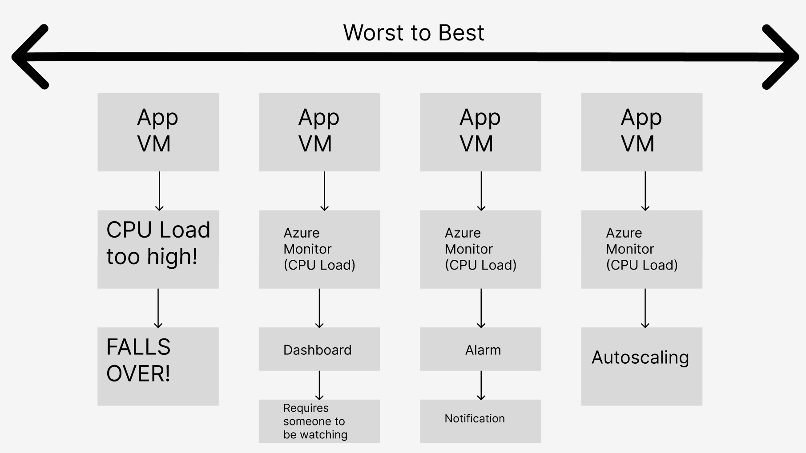
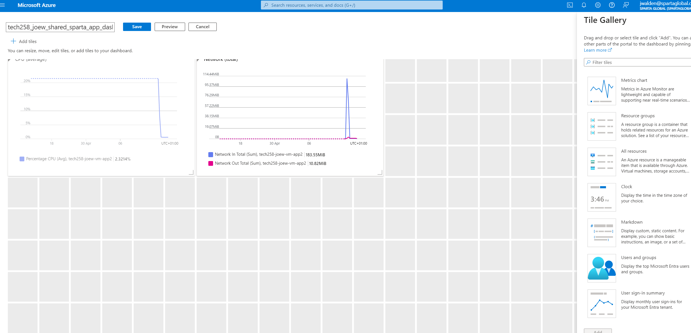
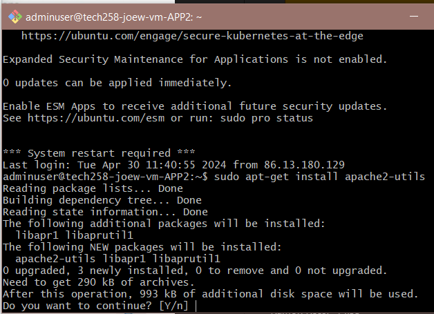
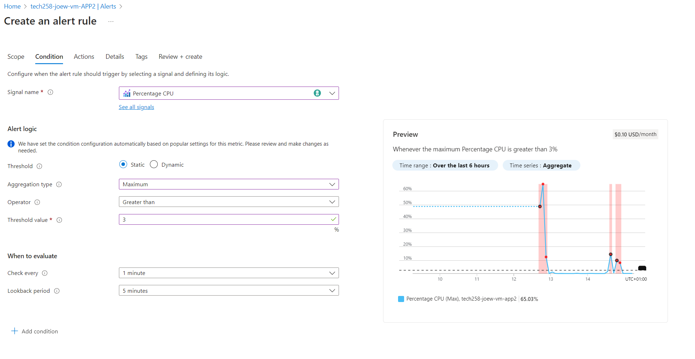
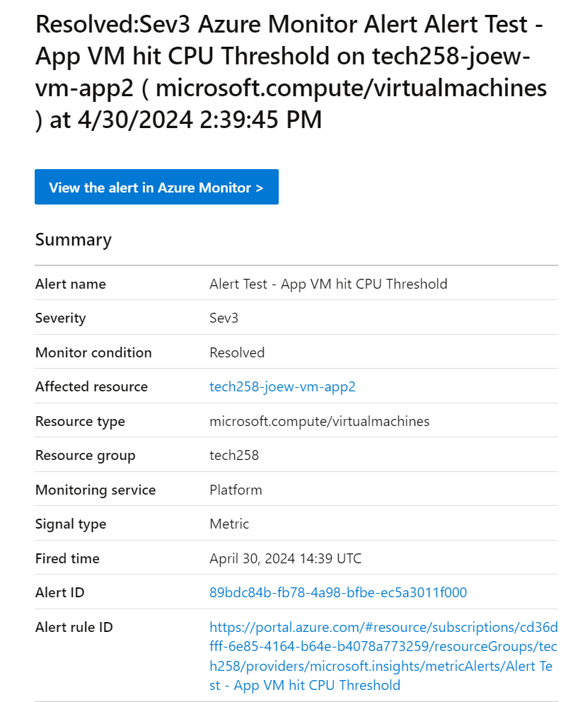

# Monitoring and Alert Management

# Monitoring



Monitoring in Azure is called Azure monitor, and monitoring in AWS is called Cloudwatch.

## Scenarios in Monitoring



We can enter the monitoring dashboard, and a large amount is customizable to our needs.



To run the pache load tester:

On bash, Install apache, a loadtester:
```
sudo apt-get install apache2-utils
```
The next commands send traffic to the app, and test to see how long it takes. You can also see the reuslts in the monitoring tab on Azure.
Make sure to paste in the url of your app browser into the command below, then enter the command into bash
```
ab -n 1000 -c 100 http://4.234.12.96/
```



```
ab -n 10000 -c 200 http://4.234.12.96/
```
```
ab -n 40000 -c 300 http://4.234.12.96/
```
Usually the threshold will be alot higher, but for test purposes, we will set it much lower to trigger an email notification.

# Alerts

We can add alerts to our VMs, so as soon as any threshold is met, an alert can be texted or emailed to you. The create alert screen looks like the image below:



and the alert email looks like this:



# Autoscaling

Autoscaling automatically responds when it reaches a threshold specified by you, can scale out, and scale in. Doesn't mean scaling up or scaling down (This means that your current VM is replaced by a smaller/larger VM)
Autoscaling increases/decreases the amount of VMs running as well as the current one.
