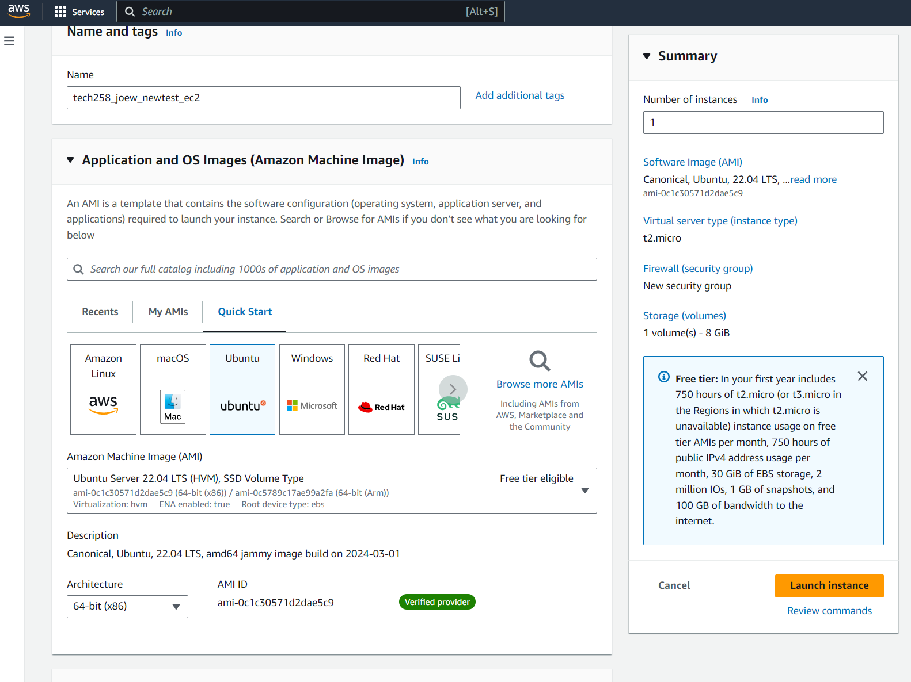
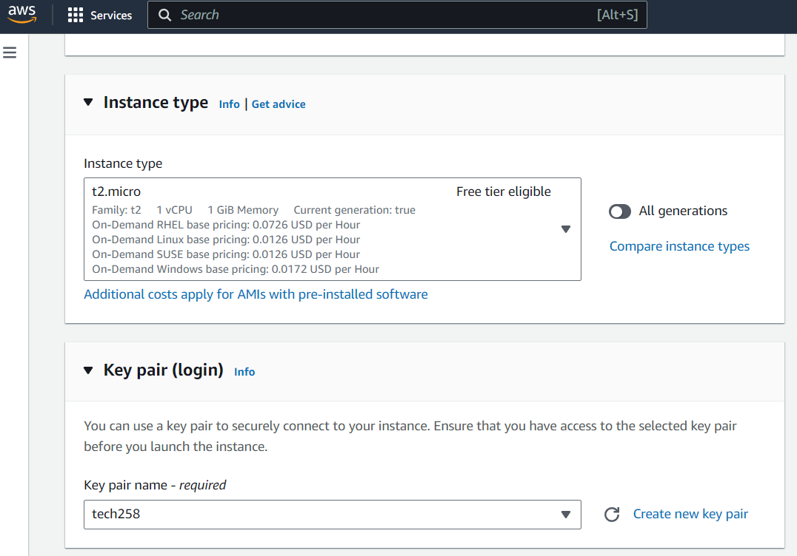
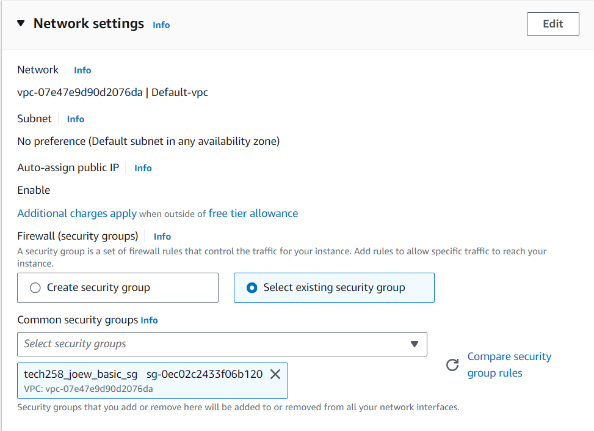
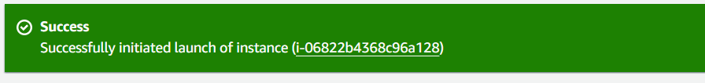
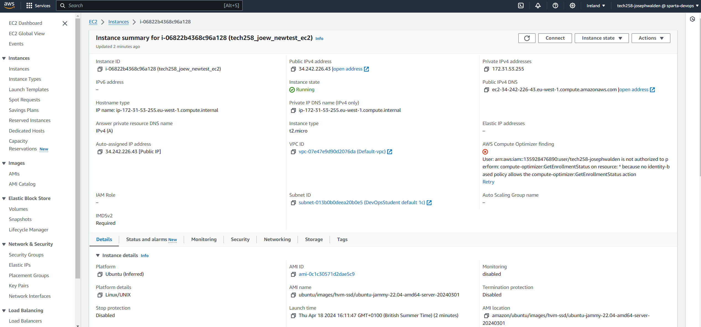
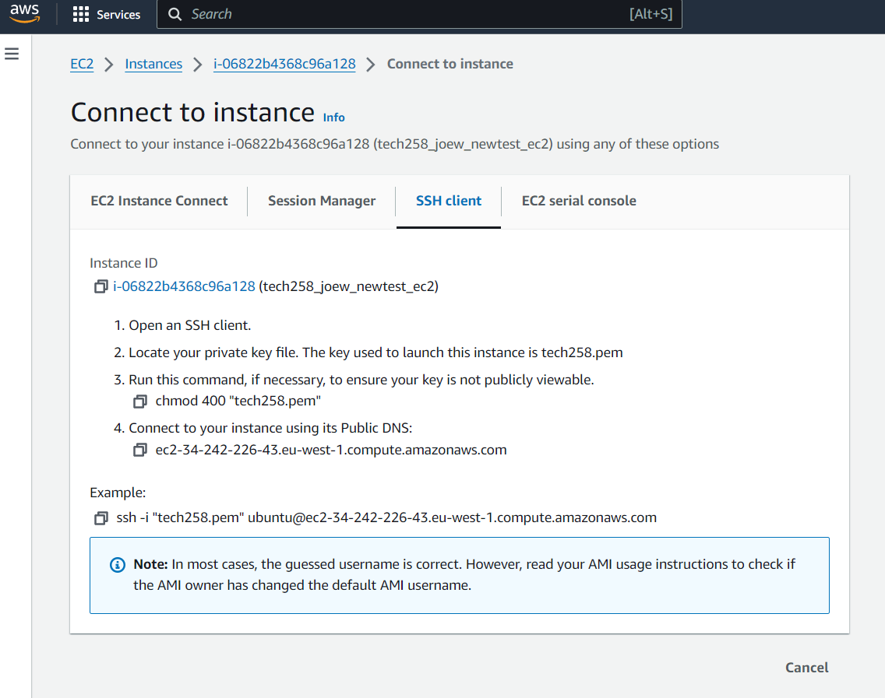
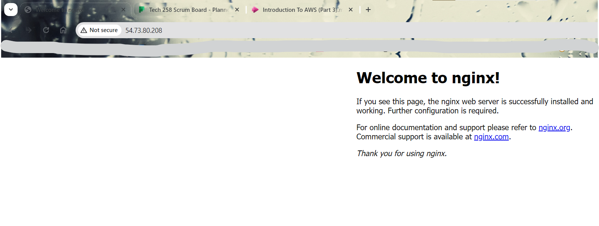

# Tech 258

## AWS

###  How to deploying a virtual machine (ec2-instance) on AWS using the gui console

#### Step 1: Log in to AWS
Ensure that you are correctly logged in, and are in the right server (Ireland, eu-west-1)

#### Step 2 : Go to EC2 (Elastic Compute Cloud), and select new instance.
Give it an appropriate name, such as `tech258_joew_newtest_ec2`.
In Application and OS Images, change it to Ubuntu. Make sure the Amazon Machine Image is on the free tier.

Machine images refer to a snapshot or template of a computer system's state, 
including its operating system, installed software, configurations, and data. 
They are used in rapid deployment, and they ensure consistency and repeatability.



#### Step 3: On Instance Type, select t2.Micro
This is the instance you have available for free. Changing it will affect what specs your VM will have, 
with the different amount of CPUs, RAM and cost being listed under each option.

#### Step 4: On Key Pair Login, select tech258
This uses the SSH key we already have in our system in the ssh folder. 
It allows us to access the VM once created, and only people with the key will be able to access it.



#### Step 5: On Network Settings, use the existing security group called `tech258_joew_basic_sg`
This is a profile we created earlier.
It has settings to allow HTTP traffic, and allow SSH traffic.
Security groups are a set of firewall rules that control inbound and outbound network traffic for one or more instances (virtual machines).
They control traffic to IP addresses and ports. Each IP address is bound to a machine, and each machine has many, many ports.
An analogy would be an IP address represents a house, and the port represents a room in the house.



#### Step 6: In Configure Storage, keep the default.
It should be 8GiB gp2.

#### Step 7: Click Launch Instance, and now you have successfully created your instance!

<br>
This is your instance summary screen. It has lots of important details, such as your public and private IP addresses.
<br>


#### Step 8: How to connect to your instance.
On the instance summary screen, click Connect. Your screen will now look like this.

<br>
Follow the instructions on the screen **up to point 3**, making sure you are using Git, and **you are in the SSH repository.**
This is so you can connect to the instance, as we locked it using SSH, and we have the corresponding key.
<br> Now instead of following point 4, use the example command, as that contains all the necessary info.
<br> Git will ask you if you want to continue connecting. Enter `yes`.
Your shell should now have a similar line on the console as the image below., as you are now no longer using the console on your PC.


### How to deploy NGINX

NGINX is a web server and reverse proxy server that works by handling incoming network requests and serving web content.
We will use it to signal if our ec2 is functioning, and we can access the webpage on our browser.

#### Step 9:
Enter the commands:
```
sudo apt update -y
sudo apt upgrade -y
```
These update *(do we have the latest packages on record?)* and upgrade *(put the latest versions in to effect)* the linux shell.
Then enter the next command.
```
sudo apt install nginx -y
```
The `-y` in the commands above mean that if the console asks if we want to install something, then the console automatically inputs yes.

#### Step 10: Go back to the instance summary on AWS, and copy your public IP to the clipboard.
Pasting the IP address into the web browser brings you to the nginx webpage. Congratulations, you have successfully established a connection to your ec2!

