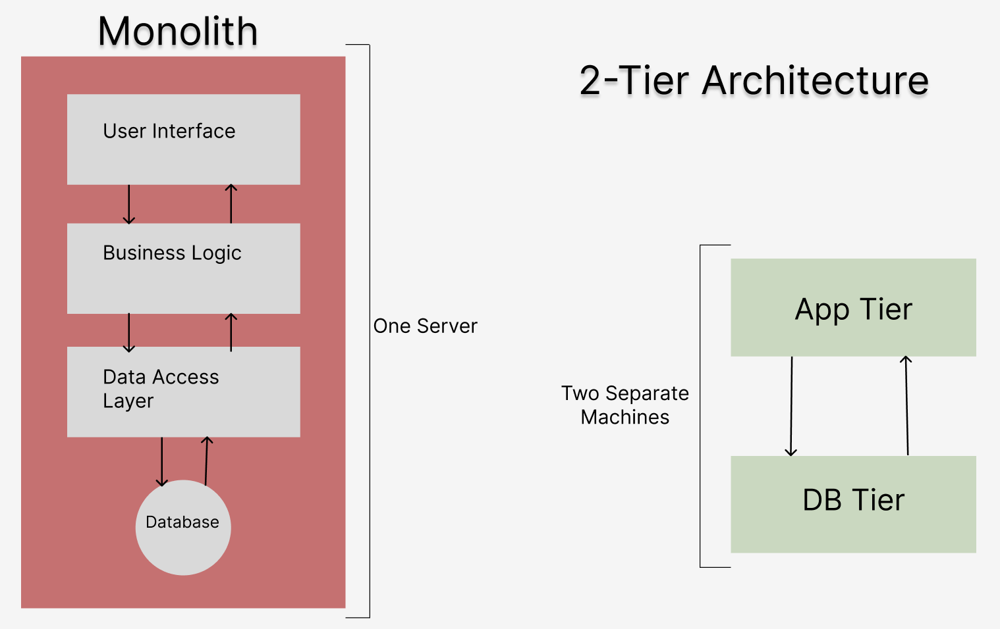
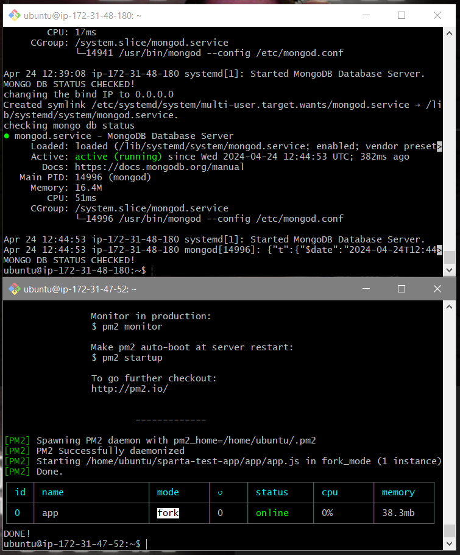

# App Deployment

- [App Deployment](#app-deployment)
    - [Updating and Upgrading Packages:](#updating-and-upgrading-packages)
      - [Run:](#run)
    - [Installing and Configuring Nginx:](#installing-and-configuring-nginx)
      - [Install Nginx:](#install-nginx)
      - [Restart and Enable Nginx:](#restart-and-enable-nginx)
    - [Installing Node.js 20:](#installing-nodejs-20)
      - [Install Node.js 20:](#install-nodejs-20)
      - [Check Node.js Version:](#check-nodejs-version)
    - [Deploying the App:](#deploying-the-app)
      - [Copy the app folder to the EC2 instance:](#copy-the-app-folder-to-the-ec2-instance)
    - [Running the App:](#running-the-app)
      - [Connect to the EC2 instance via SSH:](#connect-to-the-ec2-instance-via-ssh)
      - [Navigate to the app folder on the ec2 bash window:](#navigate-to-the-app-folder-on-the-ec2-bash-window)
      - [Install app dependencies and start the app:](#install-app-dependencies-and-start-the-app)
    - [Raw Script for the App (without database)](#raw-script-for-the-app-without-database)
- [2-Tier App Deployment](#2-tier-app-deployment)
  - [Why is 2-Tier Architecture preferred to a Monolith](#why-is-2-tier-architecture-preferred-to-a-monolith)
  - [Setting Up MongoDB 7.0.6 on Ubuntu 22.04](#setting-up-mongodb-706-on-ubuntu-2204)
      - [Step 0: Create an EC2 Instance and Configure Security Group](#step-0-create-an-ec2-instance-and-configure-security-group)
      - [Step 1: Log in to the Instance](#step-1-log-in-to-the-instance)
      - [Step 2: Update and Upgrade Packages](#step-2-update-and-upgrade-packages)
      - [Step 3: Install MongoDB 7.0.6](#step-3-install-mongodb-706)
      - [Step 4: Configure Bind IP in MongoDB Configuration](#step-4-configure-bind-ip-in-mongodb-configuration)
      - [Step 5: Restart MongoDB](#step-5-restart-mongodb)
      - [Step 6: Enable MongoDB](#step-6-enable-mongodb)
      - [Step 7: Check MongoDB Status](#step-7-check-mongodb-status)
  - [Connecting Your Application to MongoDB](#connecting-your-application-to-mongodb)
    - [Raw Script for MongoDB deployment](#raw-script-for-mongodb-deployment)
    - [Raw script for app deployment with MongoDB](#raw-script-for-app-deployment-with-mongodb)


### Updating and Upgrading Packages:
#### Run:
```
echo "Updating..."
sudo DEBIAN_FRONTEND=noninteractive apt update -y
echo "Updated!"
echo "Upgrading packages..."
sudo DEBIAN_FRONTEND=noninteractive apt upgrade -y
echo "Packages upgraded!"
```

### Installing and Configuring Nginx:

#### Install Nginx:
```
echo "Installing Nginx..."
sudo apt install nginx -y
echo "Nginx installed!"
```

#### Restart and Enable Nginx:

```
echo "Restarting Nginx..."
sudo systemctl restart nginx
echo "Nginx restarted!"
echo "Enabling Nginx..."
sudo systemctl enable nginx
echo "Nginx enabled!"
```

### Installing Node.js 20:

#### Install Node.js 20:

```
echo "Installing Node.js 20..."
curl -fsSL https://deb.nodesource.com/setup_20.x | sudo -E bash - && \
sudo apt-get install -y nodejs
echo "Node.js 20 installed!"
```

#### Check Node.js Version:

```
echo "Checking Node.js version..."
node -v
echo "Node.js version checked!"
```

### Deploying the App:

#### Copy the app folder to the EC2 instance:

```
echo "Copying app folder to EC2 instance..."
scp -i "path/to/your/private_key.pem" -r "path/to/your/local/app-folder" ubuntu@your_ec2_instance_ip:~/
echo "App folder copied!"
```

After running these commands, your bash windows should look similar to the image below.


### Running the App:

#### Connect to the EC2 instance via SSH:

```
ssh -i "path/to/your/private_key.pem" ubuntu@your_ec2_instance_ip
```

#### Navigate to the app folder on the ec2 bash window:

```
cd ~/sparta-test-app
```

#### Install app dependencies and start the app:

```
echo "Installing app dependencies..."
npm install
echo "Dependencies installed!"
echo "Starting the app..."
npm start
```

After this, a message should appear stating that your app is ready to use, and which port to access it on. 
In this case, that's port 3000. The image below should be on your browser, this means your app works. Congratulations!


### Raw Script for the App (without database)
```
#!/bin/bash

echo updating...
sudo DEBIAN_FRONTEND=noninteractive apt update -y
echo UPDATED!

echo upgrade packages...
sudo DEBIAN_FRONTEND=noninteractive apt upgrade -y
echo PACKAGES UPGRADED!
 
echo installing nginx...
sudo DEBIAN_FRONTEND=noninteractive apt install nginx -y
echo NGINX INSTALLED!
 
# configure reverse proxy
# changing configuration file

echo restarting nginx...
sudo systemctl restart nginx
echo NGINX RESTARTED!
 
echo enabling nginx...
sudo systemctl enable nginx
echo NGINX ENABLED!

echo installing git...
sudo apt install git -y
echo DONE!

echo getting repo...
git clone https://github.com/joe01w/sparta-test-app
echo CLONED REPO!

echo going to app folder...
cd ~/sparta-test-app/app
echo IN APP FOLDER!

echo install node js v20...
curl -fsSL https://deb.nodesource.com/setup_20.x | sudo DEBIAN_FRONTEND=noninteractive -E bash - &&\
sudo DEBIAN_FRONTEND=noninteractive apt-get install -y nodejs
echo NODE JS INSTALLED!

echo check node js version...
node -v
echo NODE JS VERSION CHECKED!

echo installing app...
npm install
echo APP INSTALLED!

echo installing pm2...
sudo npm install -g pm2
echo FINISHED INSTALLING PM2!

echo stopping processes...
sudo pm2 stop all
echo PROCESSES STOPPED!

echo running app...
pm2 start app.js
echo DONE!
```

# 2-Tier App Deployment

## Why is 2-Tier Architecture preferred to a Monolith

**Monolithic Architecture:**

* All components run on one server.
* Simple to develop and deploy initially.
* Hard to scale and maintain as the application grows.
* Prone to security risks and resilience issues.

**Two-Tier Architecture:**

* Separates the application into client-side and server-side.
* Allows for scalability and modularity.
* More flexible and resilient.
* Communication complexity between client and server.

In summary, while monolithic architectures are simple initially but challenging to scale and maintain, two-tier architectures offer scalability and modularity at the cost of increased communication complexity.



## Setting Up MongoDB 7.0.6 on Ubuntu 22.04

#### Step 0: Create an EC2 Instance and Configure Security Group

Create an EC2 instance on AWS and configure the security group to allow inbound traffic on port 27017, the default port for MongoDB.

#### Step 1: Log in to the Instance

SSH into your EC2 instance using your preferred terminal application.

#### Step 2: Update and Upgrade Packages

```
sudo apt update && sudo apt upgrade -y
```

#### Step 3: Install MongoDB 7.0.6

```
# Install prerequisites
sudo apt-get install gnupg curl 
```

```
# Add MongoDB repository key
curl -fsSL https://www.mongodb.org/static/pgp/server-7.0.asc | \
   sudo gpg -o /usr/share/keyrings/mongodb-server-7.0.gpg \
   --dearmor
```

```
# Add MongoDB repository
echo "deb [ arch=amd64,arm64 signed-by=/usr/share/keyrings/mongodb-server-7.0.gpg ] https://repo.mongodb.org/apt/ubuntu jammy/mongodb-org/7.0 multiverse" | sudo tee /etc/apt/sources.list.d/mongodb-org-7.0.list
```

```
# Update package list
sudo apt-get update
```

```
# Install MongoDB 7.0.6
sudo DEBIAN_FRONTEND=noninteractive apt-get install -y mongodb-org=7.0.6 mongodb-org-database=7.0.6 mongodb-org-server=7.0.6 mongodb-mongosh=2.2.4 mongodb-org-mongos=7.0.6 mongodb-org-tools=7.0.6
```

The following commands ensure that the version of MongoDB you have installed remains that version, and isn't automatically updated to the latest version. This ensures compatability.
```
echo "mongodb-org hold" | sudo dpkg --set-selections
echo "mongodb-org-database hold" | sudo dpkg --set-selections
echo "mongodb-org-server hold" | sudo dpkg --set-selections
echo "mongodb-mongosh hold" | sudo dpkg --set-selections
echo "mongodb-org-mongos hold" | sudo dpkg --set-selections
echo "mongodb-org-tools hold" | sudo dpkg --set-selections
```

#### Step 4: Configure Bind IP in MongoDB Configuration
This is an command to automate this, and manually you would have cd into the app folder, nano into the text editor, and change the bind IP.
This is so other machines can communicate with the database.
```
sudo sed -i 's/^\(\s*\)bindIp: .*/\1bindIp: 0.0.0.0/' /etc/mongod.conf
```

#### Step 5: Restart MongoDB

```
sudo systemctl restart mongod
```

#### Step 6: Enable MongoDB

```
sudo systemctl enable mongod
```

#### Step 7: Check MongoDB Status

```
sudo systemctl status mongod
```

That's it! MongoDB 7.0.6 should now be installed, configured, and running on your Ubuntu 22.04 instance. You can proceed to connect your application to the MongoDB database.

## Connecting Your Application to MongoDB

1. Ensure that MongoDB is running in a separate terminal.
2. SSH into your EC2 instance.
3. Run the usual commands to access the app, but also incorperate the commands below.
4. Run the following commands:

This command **creates** a DB_HOST environment variable, and we need to add the private IP address of **your** Mongo database EC2 instance.
```
export DB_HOST=mongodb://(YourPrivateIPAddress):27017/posts
```
```
cd ~/sparta-test-app/app
```
```
npm install
```
```
npm start
```

When both scripts are run on each terminal, they should look like the images below, and you should be able to access the app through the public app IP address.



4. Visit your website at (YourIPAddress):3000/forms.
This will connect your application to the MongoDB database and allow you to access it through your website.
Your browser should now look like this.
<br>
<br>


We can also alter the script, so the website address doesn't require the port (3000).
We do this through changing the config file and setting up a reverse proxy.
```
echo changing config file and setting up reverse proxy ...
sudo sed -i '51s/.*/\t        proxy_pass http:\/\/localhost:3000;/' /etc/nginx/sites-available/default
echo NGINX CONFIGURED FOR REVERSE PROXY!
```

### Raw Script for MongoDB deployment
```
#!/bin/bash

echo updating...
sudo DEBIAN_FRONTEND=noninteractive apt update -y
echo UPDATED!

echo upgrade packages...
sudo DEBIAN_FRONTEND=noninteractive apt upgrade -y
echo PACKAGES UPGRADED!

# install mongo db 7.0.6

echo installing mongo db...
sudo apt-get install gnupg curl 

curl -fsSL https://www.mongodb.org/static/pgp/server-7.0.asc | \
   sudo gpg -o /usr/share/keyrings/mongodb-server-7.0.gpg \
   --dearmor

echo "deb [ arch=amd64,arm64 signed-by=/usr/share/keyrings/mongodb-server-7.0.gpg ] https://repo.mongodb.org/apt/ubuntu jammy/mongodb-org/7.0 multiverse" | sudo tee /etc/apt/sources.list.d/mongodb-org-7.0.list

sudo apt-get update

sudo DEBIAN_FRONTEND=noninteractive apt-get install -y mongodb-org=7.0.6 mongodb-org-database=7.0.6 mongodb-org-server=7.0.6 mongodb-mongosh=2.2.4 mongodb-org-mongos=7.0.6 mongodb-org-tools=7.0.6

echo "mongodb-org hold" | sudo dpkg --set-selections
echo "mongodb-org-database hold" | sudo dpkg --set-selections
echo "mongodb-org-server hold" | sudo dpkg --set-selections
echo "mongodb-mongosh hold" | sudo dpkg --set-selections
echo "mongodb-org-mongos hold" | sudo dpkg --set-selections
echo "mongodb-org-tools hold" | sudo dpkg --set-selections

echo MONGO DB INSTALLED!

echo checking mongodb version...
mongod --version

echo starting mongo db...
sudo systemctl start mongod
echo MONGO DB STARTED!

# configure bind IP in mongo db config file , change it to 0.0.0.0

echo changing the bind IP to 0.0.0.0
sudo sed -i 's/^\(\s*\)bindIp: .*/\1bindIp: 0.0.0.0/' /etc/mongod.conf
# in network interfaces, change bind IP to 0.0.0.0

# restart mongo db
sudo systemctl restart mongod

# enable mongo db
sudo systemctl enable mongod

# make sure its running correctly
echo checking mongo db status
sudo systemctl status mongod
echo MONGO DB STATUS CHECKED!
```

### Raw script for app deployment with MongoDB
```
# MAKE SURE YOU CHANGE THE IP ADDRESS BELOW

#!/bin/bash

echo updating...
sudo DEBIAN_FRONTEND=noninteractive apt update -y
echo UPDATED!

echo upgrade packages...
sudo DEBIAN_FRONTEND=noninteractive apt upgrade -y
echo PACKAGES UPGRADED!
 
echo installing nginx...
sudo DEBIAN_FRONTEND=noninteractive apt install nginx -y
echo NGINX INSTALLED!

echo changing config file and setting up reverse proxy ...
sudo sed -i '51s/.*/\t        proxy_pass http:\/\/localhost:3000;/' /etc/nginx/sites-available/default
echo NGINX CONFIGURED FOR REVERSE PROXY!

echo restarting nginx...
sudo systemctl restart nginx
echo NGINX RESTARTED!

echo enabling nginx...
sudo systemctl enable nginx
echo NGINX ENABLED!

echo getting repo...
git clone https://github.com/joe01w/sparta-test-app
echo CLONED REPO!

echo going to app folder...
cd ~/sparta-test-app/app
echo IN APP FOLDER!

echo install node js v20...
curl -fsSL https://deb.nodesource.com/setup_20.x | sudo DEBIAN_FRONTEND=noninteractive -E bash - &&\
sudo DEBIAN_FRONTEND=noninteractive apt-get install -y nodejs
echo NODE JS INSTALLED!

echo check node js version...
node -v
echo NODE JS VERSION CHECKED!


# set DB_HOST env var
# MAKE SURE YOU CHANGE THE IP ADDRESS TO THE PRIVATE IP ADDRESS OF THE DATABASE EC2
export DB_HOST=mongodb://172.31.48.180/posts
printenv DB_HOST


echo installing app...
npm install
echo APP INSTALLED!

echo installing pm2...
sudo npm install -g pm2
echo FINISHED INSTALLING PM2!

echo stopping processes...
sudo pm2 stop all
echo PROCESSES STOPPED!

echo running app...
pm2 start app.js
echo DONE!
```