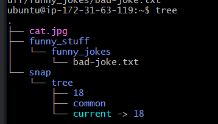
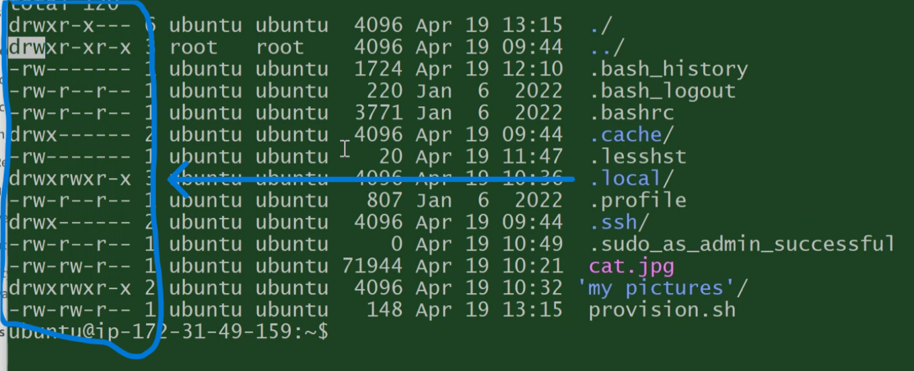

# Tech 258

## Linux Commands and what they do


- [Tech 258](#tech-258)
  - [Linux Commands and what they do](#linux-commands-and-what-they-do)
  - [Commands to download, move, copy and remove existing files and directories](#commands-to-download-move-copy-and-remove-existing-files-and-directories)
  - [Commands to create new files, add text to them, and return certain lines from those text files](#commands-to-create-new-files-add-text-to-them-and-return-certain-lines-from-those-text-files)
  - [Commands to interact, update and install packages](#commands-to-interact-update-and-install-packages)
  - [Automating](#automating)
      - [Linux Permission forms:](#linux-permission-forms)
  - [NGINX](#nginx)
      - [if you are stuck on something, and not on the command line, try pressing q. if that doesnt work, use ctrl + c](#if-you-are-stuck-on-something-and-not-on-the-command-line-try-pressing-q-if-that-doesnt-work-use-ctrl--c)
    - [Environment Variables](#environment-variables)
  - [Processes](#processes)
    - [Parent processes and child processes](#parent-processes-and-child-processes)
    - [Kill Signals](#kill-signals)
- [App Deployment](#app-deployment)
    - [Updating and Upgrading Packages:](#updating-and-upgrading-packages)
      - [Run:](#run)
    - [Installing and Configuring Nginx:](#installing-and-configuring-nginx)
      - [Install Nginx:](#install-nginx)
      - [Restart and Enable Nginx:](#restart-and-enable-nginx)
    - [Installing Node.js 20:](#installing-nodejs-20)
      - [Install Node.js 20:](#install-nodejs-20)
      - [Check Node.js Version:](#check-nodejs-version)
    - [Deploying the App:](#deploying-the-app)
      - [Copy the app folder to the EC2 instance:](#copy-the-app-folder-to-the-ec2-instance)
    - [Running the App:](#running-the-app)
      - [Connect to the EC2 instance via SSH:](#connect-to-the-ec2-instance-via-ssh)
      - [Navigate to the app folder on the ec2 bash window:](#navigate-to-the-app-folder-on-the-ec2-bash-window)
      - [Install app dependencies and start the app:](#install-app-dependencies-and-start-the-app)
- [2-Tier App Deployment](#2-tier-app-deployment)
  - [Setting Up MongoDB 7.0.6 on Ubuntu 22.04](#setting-up-mongodb-706-on-ubuntu-2204)
      - [Step 0: Create an EC2 Instance and Configure Security Group](#step-0-create-an-ec2-instance-and-configure-security-group)
      - [Step 1: Log in to the Instance](#step-1-log-in-to-the-instance)
      - [Step 2: Update and Upgrade Packages](#step-2-update-and-upgrade-packages)
      - [Step 3: Install MongoDB 7.0.6](#step-3-install-mongodb-706)
      - [Step 4: Configure Bind IP in MongoDB Configuration](#step-4-configure-bind-ip-in-mongodb-configuration)
      - [Step 5: Restart MongoDB](#step-5-restart-mongodb)
      - [Step 6: Enable MongoDB](#step-6-enable-mongodb)
      - [Step 7: Check MongoDB Status](#step-7-check-mongodb-status)
  - [Connecting Your Application to MongoDB](#connecting-your-application-to-mongodb)


## Commands to download, move, copy and remove existing files and directories

```
ls
```

shows all normal files

```
ls -a
```
shows all your files, including hidden folders

```
curl https://cdn.britannica.com/39/7139-050-A88818BB/Himalayan-chocolate-point.jpg --output cat.jpg
```
curl + link you want to download + where you want to download it to

```
file cat.jpg
```
shows us information about the image/file

```
mv cat.jpg cat
```
move + what file we want to move + where we move it to
linux still knows what type of file it is, windows wouldnt know

```
cp cat cat.jpg
```
copy + what file we want to copy + where we copy the file to

```
rm cat
```
remove + file name we want to remove

```
mkdir funny_stuff
```
make directory + name of the directory we want to make
linux doesnt like spaces in names, as it will make 2 directorys, rather than one (i.e. Funny, stuff = 2 directories)

```
rm -r funny
```
remove + -r means recursive, delete everything inside + target of the remove

## Commands to create new files, add text to them, and return certain lines from those text files

```
touch chicken-joke.txt
```
will make an empty file in the current directory with the name specified

```
nano *file-name.txt*
```
creates a files straight away and lets you edit the contents

```
nano chicken-joke.txt
```
text editor, can add content

Use a command to print the top 2 lines of chicken-joke.txt to the screen
```
head -n 2 chicken-joke.txt
```

Use a command to print the bottom 2 lines of chicken-joke.txt to the screen
```
tail -n 2 chicken-joke.txt
```

Use a command to number the lines of chicken-joke.txt when it output the file to the screen
```
cat -n chicken-joke.txt
```

Use a command only print to the screen the lines of chicken-joke.txt which contain the keyword chicken
```
grep "chicken" chicken-joke.txt
```

## Commands to interact, update and install packages

```
sudo apt update -y
```
updates current packages

```
sudo snap install tree
```
installs the package called tree

```
sudo su
```
give me super user permissions (so i can enter the root)
this is used mainly for permissions

```
tree
```
great command to see a tree diagram of files and directories



## Automating
```
./provision.sh
```
This command runs a file

These are the commands we have placed in this file to automate these tasks.
<br>update
```
sudo apt update -y
```

upgrade
```
sudo apt upgrade -y
```

install nginx
```
sudo apt install nginx -y
```

restart nginx
```
sudo systemctl restart nginx
```

enable nginx
```
sudo systemctl enable nginx
```

```
chmod 777 provision.sh (or chmod +x provision.sh)
```
change mode + what permission you want to change (read, write or execute) and for who (owner, group, public) + for what file

#### Linux Permission forms:
Long form, as letters (rw-r--r--)
short form, as numbers (777)
<br>
https://chmod-calculator.com/



## NGINX

```
systemctl status nginx
```
checks if something is running + nginx in this case

```
sudo systemctl stop nginx
```
stops the service + in this case, nginx

#### if you are stuck on something, and not on the command line, try pressing q. if that doesnt work, use ctrl + c

```
sudo systemctl enable nginx
```
as soon as the instance becomes available, nginx will start up (if used as automation)

### Environment Variables

```
printenv
```
shows the environment variables

```
nano .bashrc
```
enters a hidden file, this is a way to alter environment variables

## Processes

There are 2 types of processes in linux:
* User
* System

```
ps
```
shows us user processes

```
ps -e
```
shows us all processes

```
ps aux
```
shows all processes

```
top
```
shows us the top processes

>  shift + m       sort by memory usage
>  shift + n       newest processes
>  shift + p       processor usage


### Parent processes and child processes

* Every process has a process id
* A parent process controls child processes
* Parent processes create child processes
* There are diff levels of killing a process
* If the killing is too forceful, the child processes are left in memory, and turn into zombie processes, they just take up memory
* If a parent process is responsible for child processes, if you kill the child process, the parent will try to create the process again
* If you shut down a parent process not too forcibly, then it will try to shut down child processes, then shut down the parent process

```
sleep *num of seconds*
```
sleeps the console for that amount of seconds

```
sleep *num of seconds* &
```
sleeps for that amount of seconds in the background

```
jobs
```
shows user created processes

```
jobs -l 
```
shows user created processes and process ID	

### Kill Signals

```
kill (process ID)
```
Gentle terminate

```
kill -9 (process ID)
```
:warning:

bruteforce kill (absolute last resort)

# App Deployment

### Updating and Upgrading Packages:
#### Run:
```
echo "Updating..."
sudo DEBIAN_FRONTEND=noninteractive apt update -y
echo "Updated!"
echo "Upgrading packages..."
sudo DEBIAN_FRONTEND=noninteractive apt upgrade -y
echo "Packages upgraded!"
```

### Installing and Configuring Nginx:

#### Install Nginx:
```
echo "Installing Nginx..."
sudo apt install nginx -y
echo "Nginx installed!"
```

#### Restart and Enable Nginx:

```
echo "Restarting Nginx..."
sudo systemctl restart nginx
echo "Nginx restarted!"
echo "Enabling Nginx..."
sudo systemctl enable nginx
echo "Nginx enabled!"
```

### Installing Node.js 20:

#### Install Node.js 20:

```
echo "Installing Node.js 20..."
curl -fsSL https://deb.nodesource.com/setup_20.x | sudo -E bash - && \
sudo apt-get install -y nodejs
echo "Node.js 20 installed!"
```

#### Check Node.js Version:

```
echo "Checking Node.js version..."
node -v
echo "Node.js version checked!"
```

### Deploying the App:

#### Copy the app folder to the EC2 instance:

```
echo "Copying app folder to EC2 instance..."
scp -i "path/to/your/private_key.pem" -r "path/to/your/local/app-folder" ubuntu@your_ec2_instance_ip:~/
echo "App folder copied!"
```

After running these commands, your bash windows should look similar to the image below.


### Running the App:

#### Connect to the EC2 instance via SSH:

```
ssh -i "path/to/your/private_key.pem" ubuntu@your_ec2_instance_ip
```

#### Navigate to the app folder on the ec2 bash window:

```
cd ~/sparta-test-app
```

#### Install app dependencies and start the app:

```
echo "Installing app dependencies..."
npm install
echo "Dependencies installed!"
echo "Starting the app..."
npm start
```

After this, a message should appear stating that your app is ready to use, and which port to access it on. 
In this case, that's port 3000. The image below should be on your browser, this means you app works. Congratulations!


# 2-Tier App Deployment

## Setting Up MongoDB 7.0.6 on Ubuntu 22.04

#### Step 0: Create an EC2 Instance and Configure Security Group

Create an EC2 instance on AWS and configure the security group to allow inbound traffic on port 27017, the default port for MongoDB.

#### Step 1: Log in to the Instance

SSH into your EC2 instance using your preferred terminal application.

#### Step 2: Update and Upgrade Packages

```
sudo apt update && sudo apt upgrade -y
```

#### Step 3: Install MongoDB 7.0.6

```
# Install prerequisites
sudo apt-get install gnupg curl 
```

```
# Add MongoDB repository key
curl -fsSL https://www.mongodb.org/static/pgp/server-7.0.asc | \
   sudo gpg -o /usr/share/keyrings/mongodb-server-7.0.gpg \
   --dearmor
```

```
# Add MongoDB repository
echo "deb [ arch=amd64,arm64 signed-by=/usr/share/keyrings/mongodb-server-7.0.gpg ] https://repo.mongodb.org/apt/ubuntu jammy/mongodb-org/7.0 multiverse" | sudo tee /etc/apt/sources.list.d/mongodb-org-7.0.list
```

```
# Update package list
sudo apt-get update
```

```
# Install MongoDB 7.0.6
sudo DEBIAN_FRONTEND=noninteractive apt-get install -y mongodb-org=7.0.6 mongodb-org-database=7.0.6 mongodb-org-server=7.0.6 mongodb-mongosh=2.2.4 mongodb-org-mongos=7.0.6 mongodb-org-tools=7.0.6
```

#### Step 4: Configure Bind IP in MongoDB Configuration

```
sudo sed -i 's/^\(\s*\)bindIp: .*/\1bindIp: 0.0.0.0/' /etc/mongod.conf
```

#### Step 5: Restart MongoDB

```
sudo systemctl restart mongod
```

#### Step 6: Enable MongoDB

```
sudo systemctl enable mongod
```

#### Step 7: Check MongoDB Status

```
sudo systemctl status mongod
```

That's it! MongoDB 7.0.6 should now be installed, configured, and running on your Ubuntu 22.04 instance. You can proceed to connect your application to the MongoDB database.

## Connecting Your Application to MongoDB

1. Ensure that MongoDB is running in a separate terminal.
2. SSH into your EC2 instance.
3. Run the following commands:

```
export DB_HOST=mongodb://(YourPrivateIPAddress):27017/posts
```
```
cd ~/sparta-test-app/app
```
```
npm install
```
```
npm start
```
4. Visit your website at (YourIPAddress):3000/forms.
This will connect your application to the MongoDB database and allow you to access it through your website.
Your broswer should now look like this.
<br>
<br>

