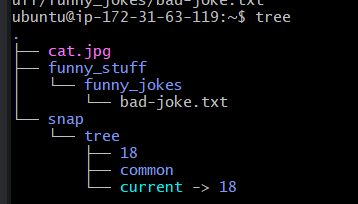
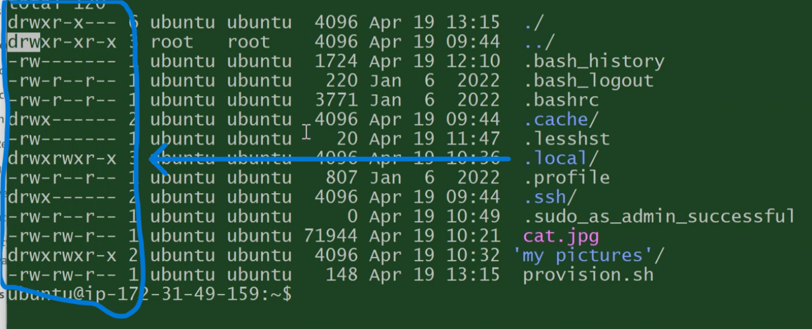

# Tech 258

## Linux Commands and What they do

## Commands to download, move, copy and remove existing files and directories

```
ls
```

shows all normal files

```
ls -a
```
shows all your files, including hidden folders

```
curl https://cdn.britannica.com/39/7139-050-A88818BB/Himalayan-chocolate-point.jpg --output cat.jpg
```
curl + link you want to download + where you want to download it to

```
file cat.jpg
```
shows us information about the image/file

```
mv cat.jpg cat
```
move + what file we want to move + where we move it to
linux still knows what type of file it is, windows wouldnt know

```
cp cat cat.jpg
```
copy + what file we want to copy + where we copy the file to

```
rm cat
```
remove + file name we want to remove

```
mkdir funny_stuff
```
make directory + name of the directory we want to make
linux doesnt like spaces in names, as it will make 2 directorys, rather than one (i.e. Funny, stuff = 2 directories)

```
rm -r funny
```
remove + -r means recursive, delete everything inside + target of the remove

## Commands to create new files, add text to them, and return certain lines from those text files

```
touch chicken-joke.txt
```
will make an empty file in the current directory with the name specified

```
nano *file-name.txt*
```
creates a files straight away and lets you edit the contents

```
nano chicken-joke.txt
```
text editor, can add content

Use a command to print the top 2 lines of chicken-joke.txt to the screen
```
head -n 2 chicken-joke.txt
```

Use a command to print the bottom 2 lines of chicken-joke.txt to the screen
```
tail -n 2 chicken-joke.txt
```

Use a command to number the lines of chicken-joke.txt when it output the file to the screen
```
cat -n chicken-joke.txt
```

Use a command only print to the screen the lines of chicken-joke.txt which contain the keyword chicken
```
grep "chicken" chicken-joke.txt
```

## Commands to interact, update and install packages

```
sudo apt update -y
```
updates current packages

```
sudo snap install tree
```
installs the package called tree

```
sudo su
```
give me super user permissions (so i can enter the root)
this is used mainly for permissions

```
tree
```
great command to see a tree diagram of files and directories



## Automating

./provision.sh
This command runs a file

These are the commands we have placed in this file to automate these tasks.
<br>update
```
sudo apt update -y
```

upgrade
```
sudo apt upgrade -y
```

install nginx
```
sudo apt install nginx -y
```

restart nginx
```
sudo systemctl restart nginx
```

enable nginx
```
sudo systemctl enable nginx
```

```
chmod 777 provision.sh (or chmod +x provision.sh)
```
change mode + what permission you want to change (read, write or execute) and for who (owner, group, public) + for what file

#### Linux Permission forms:
Long form, as letters (rw-r--r--)
short form, as numbers (777)
<br>
https://chmod-calculator.com/



### NGINX

```
systemctl status nginx
```
checks if something is running + nginx in this case

```
sudo systemctl stop nginx
```
stops the service + in this case, nginx

#### if you are stuck on something, and not on the command line, try pressing q. if that doesnt work, use ctrl + c

```
sudo systemctl enable nginx
```
as soon as the instance becomes available, nginx will start up (if used as automation)

### Environment Variables

```
printenv
```
shows the environment variables

```
nano .bashrc
```
enters a hidden file, this is a way to alter environment variables