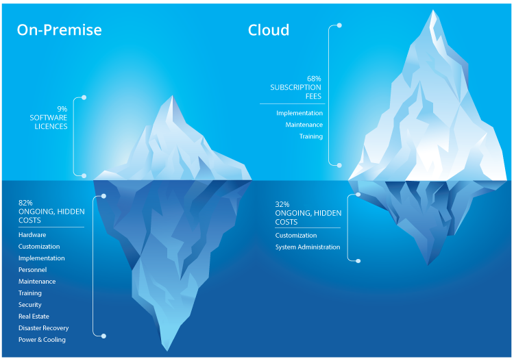
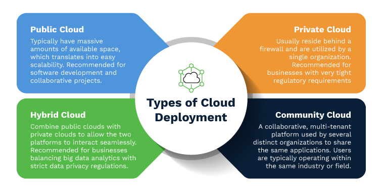
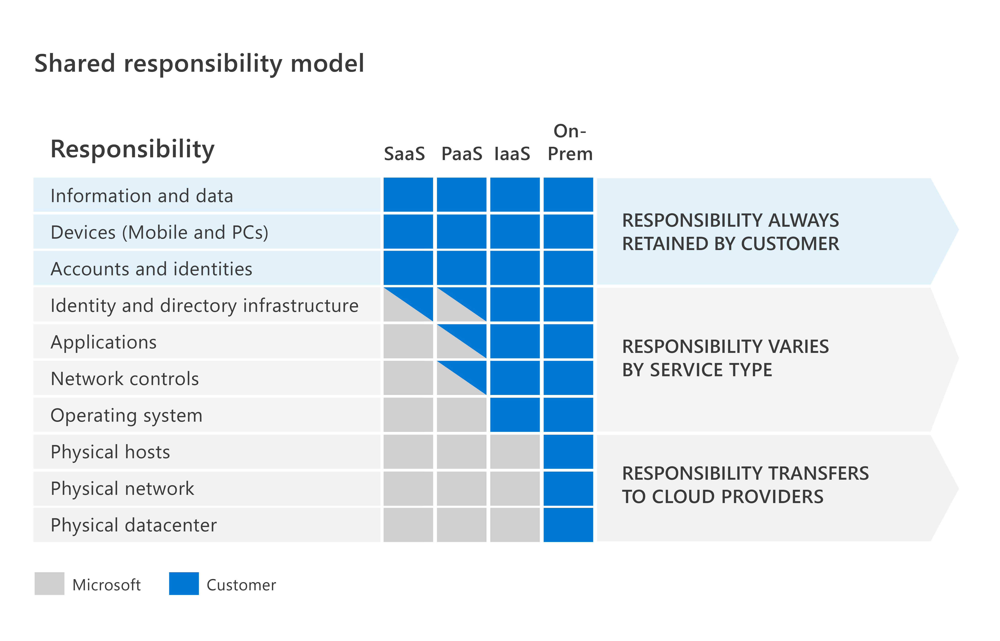
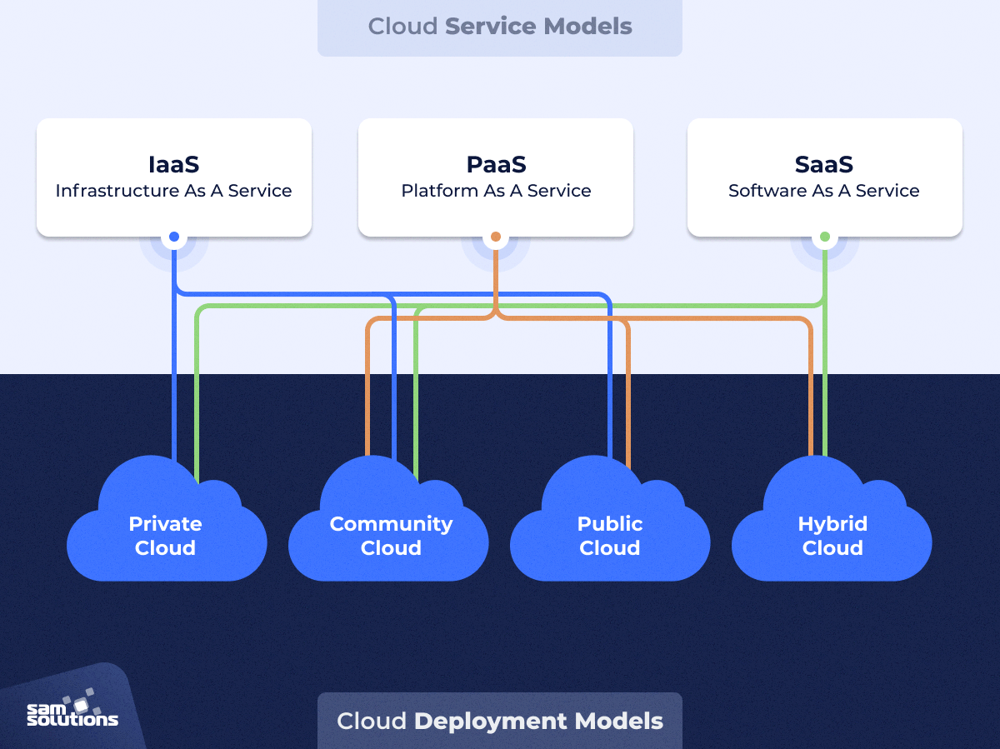
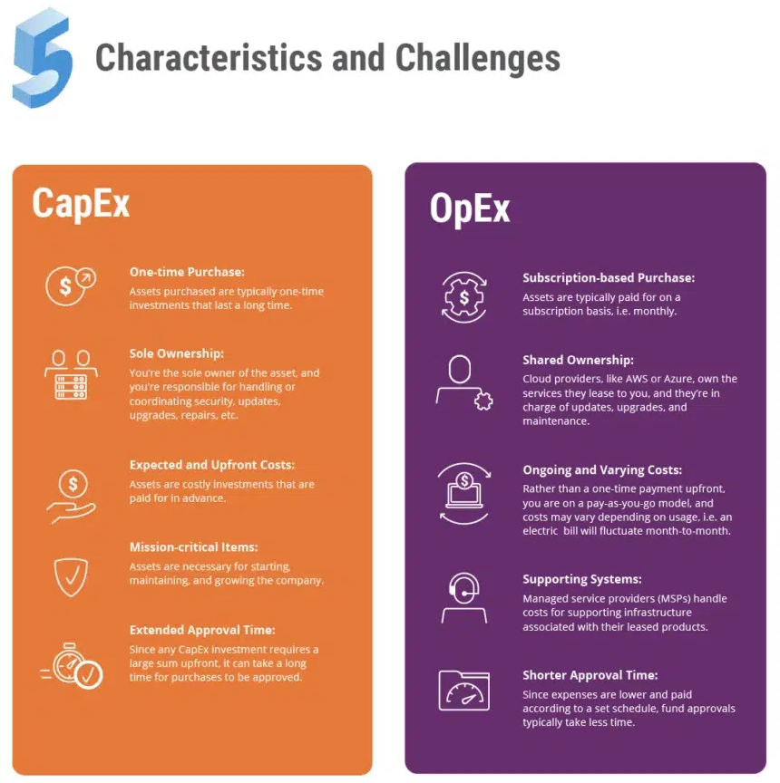
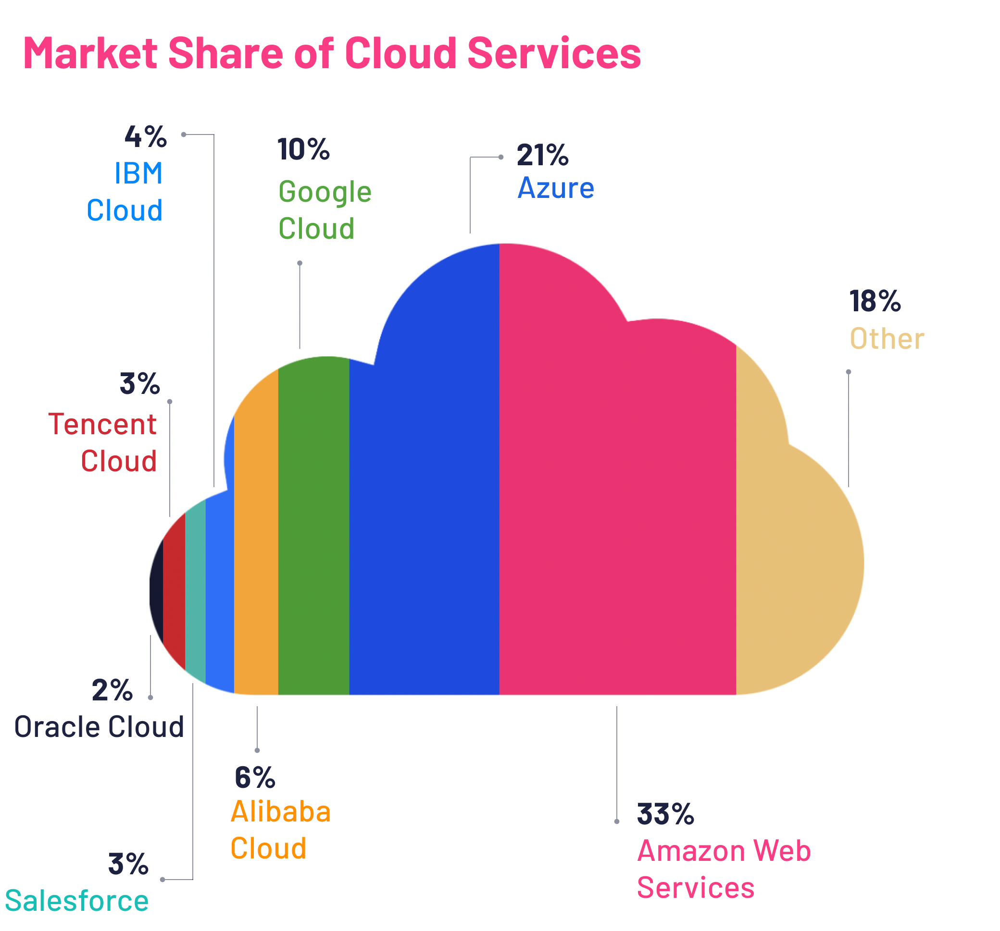

# Tech 258

## What is Cloud?

### What is cloud computing? (in layman's terms)

Cloud computing is the delivery of computing services over the cloud. It is the idea of renting a computer instead of buying one. 
Instead of having a physical computer at home or work, you use a computer that's in the cloud, which means it's somewhere else on the internet. 
You can access all your files, run programs, and do everything you'd normally do on a computer, but it's all happening on a remote server instead of on a computer sitting in front of you.

### How do we know if something is in the cloud? Differences between on-prem and the cloud?

**Data hosted on the cloud:**
* If data is stored on the cloud, it is usually hosted and managed by third-party cloud service providers in remote data centers.
* Cloud services often offer scalability, allowing users to easily scale resources up or down based on demand.
* Cloud services are owned and managed by cloud providers, relieving organizations of many operational responsibilities.

**Data hosted on-prem (on-premises):**
* Data typically is within an organization's physical premises, usually within their own data centers.
* On-premises solutions may require significant upfront investment in hardware to accommodate potential growth.
* With on-premises solutions, organizations own and are responsible for managing all aspects of the infrastructure, including hardware, software, security, and maintenance.

### The 4 deployment models of cloud: private vs public vs hybrid vs multi-cloud
Public cloud is cloud computing that’s delivered via the internet and shared across organizations.
 Private cloud is cloud computing that is dedicated solely to your organization.
 Hybrid cloud is any environment that uses both public and private clouds.
 Multi-cloud strategies incorporate combinations of private and public clouds, often from different CSPs, for flexibility in meeting operational requirements.

### Types of cloud services: IaaS, PaaS, SaaS
**IaaS (Infrastructure as a Service):**
* Accessing computer hardware and infrastructure over the cloud, including servers, networks, operating systems, and storage, through virtualization technology.
* Highly scalable services

**PaaS (Platform as a Service):**
* Accessing cloud components to certain software while being used mainly for applications. 
* PaaS delivers a framework that developers can build upon and use to create customized applications. 
* All servers, storage, and networking can be managed by the enterprise or a third-party provider while the developers can maintain management of the applications.

**SaaS (Software as a Service):**
* Accessing services over the cloud to deliver applications, which are managed by a third-party vendor, to its users. 
* A majority of SaaS applications run directly through your web browser

 

### What are the advantages/disadvantages of the cloud?
**Advantages:**

* **Scalability:** Cloud computing provides businesses with the flexibility to scale resources according to demand, enabling cost-effective adjustments to accommodate fluctuating workloads or rapid growth.
* **Cost Efficiency:** Operating on a pay-as-you-go model, cloud services offer potential cost savings compared to traditional on-premises solutions, as businesses only pay for the resources they use.
* **Accessibility:** Cloud services facilitate remote work and collaboration by allowing access from anywhere with an internet connection, enhancing productivity and flexibility for employees.
* **Reliability and Availability:** Cloud providers typically offer highly reliable infrastructure with redundancy and high availability, minimizing downtime and ensuring continuous access to services critical for business operations.
* **Security:** Cloud providers invest in robust security measures, including encryption and compliance certifications, to protect data and infrastructure, enhancing overall security posture and mitigating cyber threats.

**Disadvantages:**

* **Dependency on Internet Connectivity:** Cloud services rely on internet connectivity, making businesses vulnerable to disruptions from network outages or slow internet speeds, potentially impacting productivity and access to essential applications and data.
* **Data Privacy Concerns:** Entrusting sensitive data to third-party cloud providers raises privacy and compliance concerns, necessitating careful consideration of data governance and compliance with regulations.
* **Potential for Vendor Lock-in:** Adoption of specific cloud services may lead to vendor lock-in, hindering the ability to migrate to alternative solutions. Businesses should assess and mitigate vendor lock-in risks, such as by leveraging multi-cloud or hybrid cloud environments.
* **Performance Issues:** While cloud providers aim to deliver optimal performance, businesses may encounter latency or performance issues, particularly with high-demand workloads or low-latency data access requirements.
* **Loss of Control:** Outsourcing IT infrastructure and services to cloud providers entails relinquishing some control over hardware, software, and security. Businesses must weigh the trade-offs between control and convenience when transitioning to the cloud.

### Difference between OpEx vs CapEx

OpEx *(Operational Expenditure)* covers ongoing expenses essential for daily operations, like rent, utilities, salaries, maintenance, and subscription services.
Cloud computing typically aligns with OpEx due to its subscription-based model.
 
 
CapEx *(Capital Expenditure)* represents investments in long-term assets like property, equipment, or infrastructure, with benefits spread over multiple years.
This would count as company's owning their own data centers, within an organization's physical premises.

### Is migrating to the cloud always cheaper?

No, the balance of initial investment vs. ongoing costs should be considered. Moving to the cloud often entails transitioning from capital expenditures (CapEx) to operational expenditures (OpEx). 
While this shift can reduce upfront expenses, businesses should assess whether the long-term operational costs of cloud services align with their budget and financial objectives.
Also, businesses should consider the potential for vendor lock-in and how it might affect long-term costs. 
Additionally, cloud providers may periodically adjust pricing or introduce new pricing models, impacting cost predictability for businesses.

### Marketshare - What is the breakdown?

These three players dominate the cloud market: 
* **Amazon Web Services (AWS):** A leading provider of cloud computing platforms and APIs, offering on-demand services on a pay-as-you-go basis.
* **Microsoft Azure:** Microsoft's cloud computing service, providing solutions for building, testing, deploying, and managing applications and services.
* **Google Cloud Platform (GCP):** Google's suite of cloud computing services, leveraging the same infrastructure as Google's consumer products. 
There are other providers like IBM Cloud and Oracle Cloud.

### What are the 3 largest Cloud providers known for (What makes them popular? What are some of their USPs?)

AWS is known for its ability to easily adjust to changing needs and having good scalability. It also is the largest cloud provider, and has the most data centres across the world.
It fosters a strong community of partners and developers. 

Microsoft Azure integrates seamlessly with Microsoft products, making it popular for businesses already using Microsoft technologies. 
It offers reliable hybrid cloud solutions and advanced AI capabilities. 

GCP is renowned for its powerful data analytics and AI tools like BigQuery and TensorFlow. 
It ensures fast access to services worldwide and leads in innovation, with a focus on sustainability.

#### Which cloud provider do you think might be the best? Why?

I think it depends on what your needs are for the project. If it's scalability and a global venture, then I would suggest AWS.
  If its integration you are after, and ease of use, then I would suggest Azure.
  If you are looking for A.I. integration, then I would suggest GCP.
  Other factors such as budget and specific workload need also play a part in selecting a cloud provider.

### What sorts of things do you usually need to pay for when using the cloud?

* Compute resources like virtual machines or containers 
* Storage space for data storage and retrieval
* Network usage for data transfer in and out of the cloud
* Databases 
* AI and machine learning tools
* Monitoring and support

