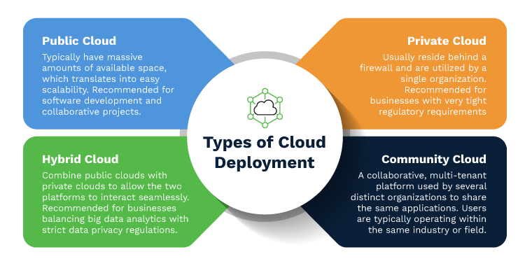

# Tech 258

## What is Cloud?

### What is cloud computing?

Cloud computing is the delivery of computing services over the cloud. It is the idea of renting a computer instead of buying one. 
Instead of having a physical computer at home or work, you use a computer that's in the cloud, which means it's somewhere else on the internet. 
You can access all your files, run programs, and do everything you'd normally do on a computer, but it's all happening on a remote server instead of on a computer sitting in front of you.

### How do we know if something is in the cloud? Differences between on-prem and the cloud?

**Data hosted on the cloud:**
* If data is stored on the cloud, it is usually hosted and managed by third-party cloud service providers in remote data centers.
* Cloud services often offer scalability, allowing users to easily scale resources up or down based on demand.
* Cloud services are owned and managed by cloud providers, relieving organizations of many operational responsibilities.

**Data hosted on-prem (on-premises):**
* Data typically is within an organization's physical premises, usually within their own data centers.
* On-premises solutions may require significant upfront investment in hardware to accommodate potential growth.
* With on-premises solutions, organizations own and are responsible for managing all aspects of the infrastructure, including hardware, software, security, and maintenance.

### The 4 deployment models of cloud: private vs public vs hybrid vs multi-cloud
Public cloud is cloud computing that’s delivered via the internet and shared across organizations.
 Private cloud is cloud computing that is dedicated solely to your organization.
 Hybrid cloud is any environment that uses both public and private clouds.
 Multi-cloud strategies incorporate combinations of private and public clouds, often from different CSPs, for flexibility in meeting operational requirements.

### Types of cloud services: IaaS, PaaS, SaaS
IaaS (Infrastructure as a Service):

PaaS (Platform as a Service):

SaaS (Software as a Service):

### What are the advantages/disadvantages of the cloud? (Particularly for a business)